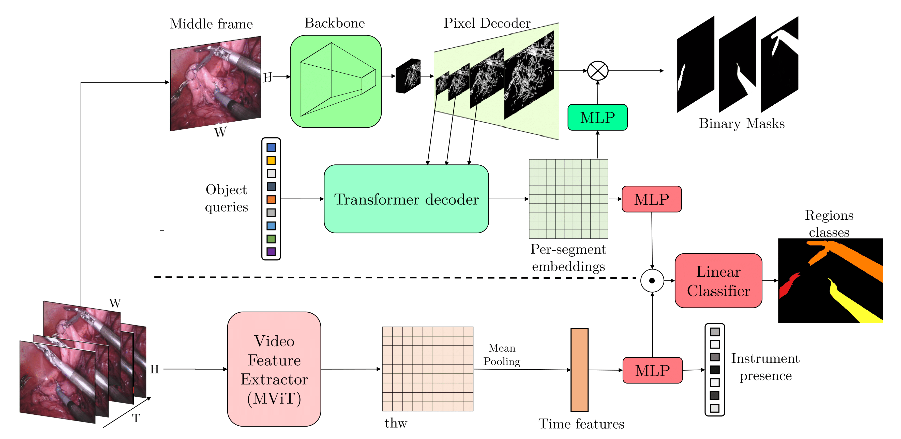

# MATIS: Masked-Attention Transformers for Surgical Instrument Segmentation

[Nicolás Ayobi](https://nayobi.github.io/), Alejandra Pérez Rondon, Santiago Rodríguez, [Pablo Arbeláez](https://scholar.google.com.co/citations?user=k0nZO90AAAAJ&hl=en)<br/>
<br/>
<font size="1"> Center  for  Research  and  Formation  in  Artificial  Intelligence .([CinfonIA](https://cinfonia.uniandes.edu.co/)),  Bogota, Colombia </font> <br/>
Universidad  de  los  Andes,  Bogotá, Colombia. <br/>

- **Oral presentation** at the **ISBI 2023.** Proceedings available at [IEEE Xplore](https://ieeexplore.ieee.org/document/10230819).<br/>
- **Winning solution** of the [2022 SAR-RARP50 challenge](https://arxiv.org/abs/2401.00496.)<br/>
- **Preprint** available at [arXiv](https://arxiv.org/abs/2303.09514).<br/>

## Abstract

<div align="center">
  
</div><br/>

We propose Masked-Attention Transformers for Surgical Instrument Segmentation (MATIS), a two-stage, fully transformer-based method that leverages modern pixel-wise attention mechanisms for instrument segmentation. MATIS exploits the instance-level nature of the task by employing a masked attention module that generates and classifies a set of fine instrument region proposals. Our method incorporates long-term video-level information through video transformers to improve temporal consistency and enhance mask classification. We validate our approach in the two standard public benchmarks, Endovis 2017 and Endovis 2018. Our experiments demonstrate that MATIS' per-frame baseline outperforms previous state-of-the-art methods and that including our temporal consistency module boosts our model's performance further.

This repository provides instructions to run the PyTorch implementation of MATIS, Oral presentation at [ISBI 2023](https://ieeexplore.ieee.org/document/10230819). 

## TAPIS and GraSP dataset

Check out [**TAPIS**](https://github.com/BCV-Uniandes/GraSP/tree/main/TAPIS), an extended version of our MATIS method for multiple Surgical Workflow Analysis tasks. Also check our [**GraSP dataset**](https://github.com/BCV-Uniandes/GraSP), a **novel benchmark** for multi-level Surgical Workflow Analysis that provides **surgical instrument segmentation** annotations. TAPIS and GraSP have been published in this [arXiv](https://arxiv.org/abs/2401.11174).

## MATIS

### Installation
Please follow these steps to run MATIS:

```sh
$ conda create --name matis python=3.8 -y
$ conda activate matis
$ conda install pytorch==1.9.0 torchvision==0.10.0 cudatoolkit=11.1 -c pytorch -c nvidia

$ conda install av -c conda-forge
$ pip install -U iopath
$ pip install -U opencv-python
$ pip install -U 'git+https://github.com/cocodataset/cocoapi.git#subdirectory=PythonAPI'
$ pip install 'git+https://github.com/facebookresearch/fvcore'
$ pip install 'git+https://github.com/facebookresearch/fairscale'
$ python -m pip install 'git+https://github.com/facebookresearch/detectron2.git'

$ git clone https://github.com/BCV-Uniandes/MATIS
$ cd MATIS
$ pip install -r requirements.txt
```

Our code builds upon [Multi Scale Vision Transformers](https://github.com/facebookresearch/SlowFast)[2]. For more information, please refer to this work.

### Preparing data

1. Download and extract the data and pretrained models from [MATIS](http://157.253.243.19/MATIS/MATIS.tar.gz). We recommend downloading and extracting the files with the following command:

```sh
$ wget -r http://157.253.243.19/MATIS/MATIS.tar.gz
$ tar -xzvf MATIS.tar.gz
```

2. Locate the downloaded data into this repository's directory named ```data```. In the end, the repo must have the following structure

  ```tree
  MATIS
      |_configs
      |    ...
      |_data
      |    |_endovis_2017
      |    |       |_annotations
      |    |       |     ...
      |    |       |_features
      |    |       |     ...
      |    |       |_images
      |    |       |     ...
      |    |       |_models
      |    |             ...
      |    |_endovis_2018
      |            |_annotations
      |            |     ...
      |            |_features
      |            |     ...
      |            |_images
      |            |     ...
      |            |_models
      |                  ...
      |_images
      |    ...
      |_matis
      |    ...
      |_run_files
      |    ...
      |_tools
           ...
  ```

### Alternative Download Methods

If you cannot download the data from our servers, you can also download the compressed archive from this [Google Drive Link](https://drive.google.com/file/d/1sbOazLT49raQhteieVsJLo5PcKO9LEKG/view?usp=sharing).

### Evaluating MATIS

| Dataset | mIoU | IoU | mcIoU | config | run file | model path |
| ----- | ----- | ----- | ----- | ----- | ----- | ----- |
| Endovis 2017 | 71.36 $\pm$ 3.46 | 66.28 | 41.09 | [EV2017_config](configs/endovis_2017/MATIS_FULL.yaml) | [EV2017_run](run_files/ENDOVIS_2017/endovis_segmentation.sh) | *MATIS/endovis_2017/models* |
| Endovis 2018 | 84.26 | 79.12 | 54.04 | [EV2018_config](configs/endovis_2018/MATIS_FULL.yaml) | [EV2018_run](run_files/ENDOVIS_2018/endovis_segmentation.sh) | *MATIS/endovis_2018/models* |

1. First, add this repository to $PYTHONPATH with the following command:

```sh
$ export PYTHONPATH=/path/to/MATIS/matis:$PYTHONPATH
```

2. Make sure that you downloaded the data and pretrained weights from [MATIS](http://157.253.243.19/MATIS/MATIS.tar.gz) and that you located directories and files into the ```data``` directory.

3. Use the following commands to evaluate Endovis 2017 or 2018.

```sh
# Evaluating on a single fold of Endovis 2017. Change the FOLD variable to modify the evaluating fold.
$ sh run_files/ENDOVIS_2017/endovis_segmentation.sh

# Evaluating on Endovis 2018.
$ sh run_files/ENDOVIS_2018/endovis_segmentation.sh
```

These are bash files with the commands to run evaluation. If you go into the files, you'll find a bunch of configuration flags with the data paths and the hyperparameters. You can modify this hyperparameter for experimentation. For the Endovis 2017 dataset, a variable named ```FOLD```corresponds to fold id between 0,1,2 and 3 to evaluate. The variable has been set to 3, but you can change it to another fold value. 

### Segmentation Baseline

We provide instructions on how to run our instrument segmentation baseline in our extended version called [TAPIS](https://github.com/BCV-Uniandes/GraSP/tree/main/TAPIS). Please check this [repo](https://github.com/BCV-Uniandes/GraSP/tree/main/TAPIS) in the Region Proposal Baseline section to run our baseline.

#### Additional Info

1. We provide the precomputed mask features from [Mask2Former](https://github.com/facebookresearch/Mask2Former)[1]. However, we also offer our pretrained Mask2Former weights in the ```models``` directory inside each dataset's directory. Feel free to use these weights to compute our region features with [Mask2Former's](https://github.com/facebookresearch/Mask2Former)[1] code and use our estimated per-class thresholds and top-k values in the ```mask2former_inference_threshold_ks.json``` file to filter regions.

2. Our pre-computed mask features (after the per-class filtering inference method) can be found in our data [link](http://157.253.243.19/MATIS/MATIS.tar.gz) in the ````features``` directory inside each dataset's folder. The directory contains a .pth file with the following structure:

```tree
{"features":
    [
      {
        "image_id": ...,
        "file_name": *.png,
        "height": ...,
        "width": ...,
        "bboxes": {
                    "x1,y1,x2,y2": <bbox_features>,
                    "x1,y1,x2,y2": <bbox_features>,
                    ...
                  },
        "segments": {
                    "x1,y1,x2,y2": <RLE_mask>,
                    "x1,y1,x2,y2": <RLE_mask>,
                    ...
                  },
      },
      {
        ...
      },
      ...
    ]
}
```
For simplicity, MATIS' dataloader identifies each mask feature by its bounding box. The RLE masks can be decoded and visualized using the ```decode``` function of the ```pycocotools.masks``` library.

3. In the ```models``` directory inside each dataset's folder in our data [link](http://157.253.243.19/MATIS/MATIS.tar.gz) there is a file named ```mask2former_inference_threshold_ks.json``` which contains the values of the calculated per-class thresholds and top-k selection values for the region filtering method in Mask2Former's inference. This file has the following structure:

```tree
{
  "Class_1":
      {
        "top_k": ...,
        "threshold": ...
      },
  "Class_2":
      {
        "top_k": ...,
        "threshold": ...
      },
  ...
}
```

### Training MATIS

1. Please use [Mask2Former's](https://github.com/facebookresearch/Mask2Former)[1] code to train our baseline and compute region proposals.

2. Our bash files are set to evaluate by default. To train, go to the bash files in [run_files/ENDOVIS_201*/endovis_segmentation.sh](run_files) and change ```TRAIN.ENABLE False``` into ```TRAIN.ENABLE True```. You can also set ````TEST.ENABLE False``` to avoid evaluating first.

3. Our bash files are set to load the pretrained weights from MATIS by default. If you want to train from MViT's pretrained weights, you should download the [MViTv1_B_16x4](https://drive.google.com/file/d/194gJinVejq6A1FmySNKQ8vAN5-FOY-QL/view?usp=sharing) model from the [SlowFast](https://github.com/facebookresearch/SlowFast)[2] repo and change the ```CHECKPOINT``` variable in our bash file to the path of those weights. You can also remove the ```TRAIN.CHECKPOINT``` flag to train from scratch.

4. After modifying the bash files, you can now run the following commands to train MATIS:

```sh
# Training on a single fold of Endovis 2017. Change the FOLD variable to modify the training fold.
$ sh run_files/ENDOVIS_2017/endovis_segmentation.sh

# Training on Endovis 2018.
$ sh run_files/ENDOVIS_2018/endovis_segmentation.sh
```

## Citing MATIS

If you use MATIS (or its extended benchmark version, TAPIS, or GraSP) in your research, please include the following BibTex citations in your papers.
```BibTeX
@misc{ayobi2024pixelwise,
      title={Pixel-Wise Recognition for Holistic Surgical Scene Understanding}, 
      author={Nicol{\'a}s Ayobi and Santiago Rodr{\'i}guez and Alejandra P{\'e}rez and Isabela Hern{\'a}ndez and Nicol{\'a}s Aparicio and Eug{\'e}nie Dessevres and Sebasti{\'a}n Peña and Jessica Santander and Juan Ignacio Caicedo and Nicol{\'a}s Fern{\'a}ndez and Pablo Arbel{\'a}ez},
      year={2024},
      eprint={2401.11174},
      archivePrefix={arXiv},
      primaryClass={cs.CV}
}

@InProceedings{ayobi2023matis,
  author={Nicol{\'a}s Ayobi and Alejandra P{\'e}rez-Rond{\'o}n and Santiago Rodr{\'i}guez and Pablo Arbel{\'a}es},
  booktitle={2023 IEEE 20th International Symposium on Biomedical Imaging (ISBI)}, 
  title={MATIS: Masked-Attention Transformers for Surgical Instrument Segmentation}, 
  year={2023},
  pages={1-5},
  doi={10.1109/ISBI53787.2023.10230819}}
```

## References

[1] B. Cheng, I. Misra, A. G. Schwing, A. Kirillov, R. Girdhar, "Mask2Former", 2022. https://github.com/facebookresearch/Mask2Former.
[2] H. Fan, Y. Li, B. Xiong, W.-Y. Lo, C. Feichtenhofer, "PySlowFast", 2020. https://github.com/facebookresearch/slowfast.
